# CGRA 2021/2022

## Group T07G04
| Name             | Number    | E-Mail             |
| ---------------- | --------- | ------------------ |
| Bruno Pascoal         | 201705562 | up201705562@up.pt                |
| Luís Cunha            | 201709375 | up201709375@up.pt                |

----

## Project

### How to play the game

In this game your objective is to collect the wood, put it on the train and move on to the next station. In order to do that you need to know the controllers for this game which are the following:
- `w` Move Crane Arm Up
- `a` Move Crane Arm Left
- `s` Move Crane Arm Down
- `d` Move Crane Arm Right
- `p` Pick/Drop Wood either from the station or the train
- `c` Start Moving the train automatically to the next station

### Extra Info

- In order for the train to move it has to move the wood from the station to the train, you can think of the wood as fuel for the train since the moment you arrive to the next station the wood is used so you need to refill it.

## Project Guide
- In Point 1 we created the track and applied textures to it;
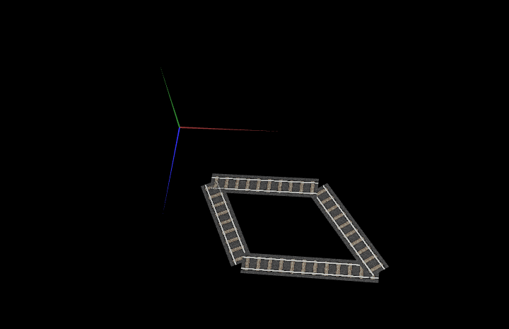  
- In Point 2 we created a circle and applied textures to it;
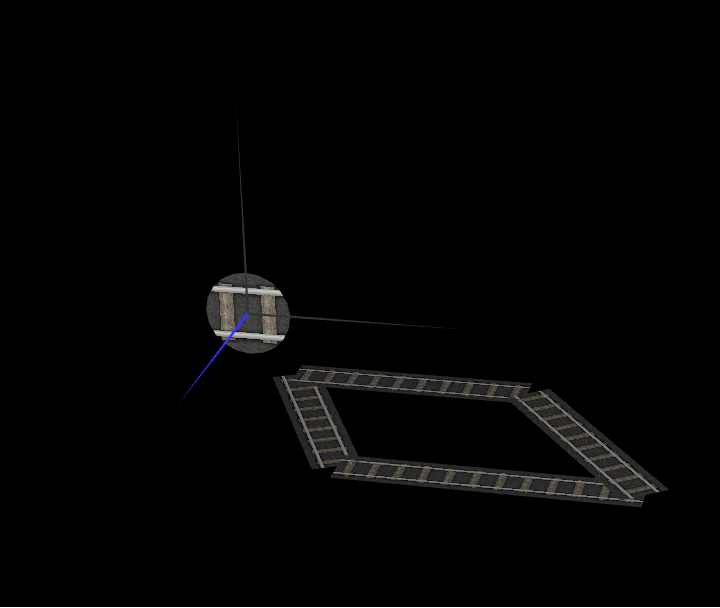
- In Point 3 we created a cyclinder using triangles;
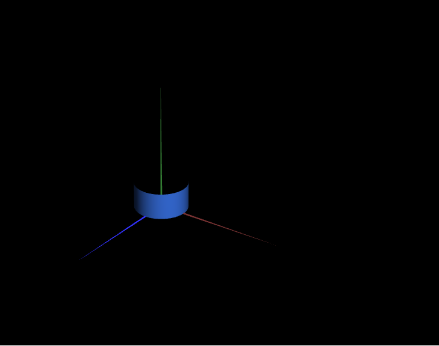
- In Point 4 we created a sphere using triangles and applied textures to it;
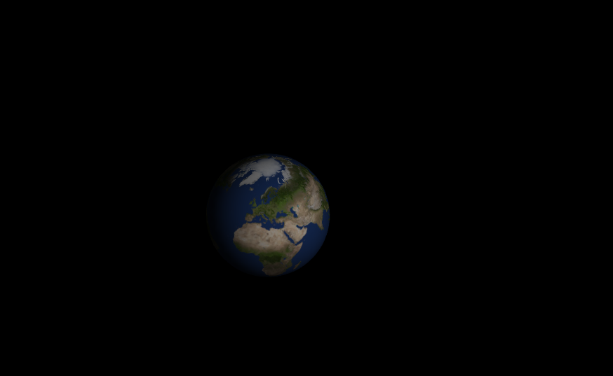
- In Point 5 we created the train using the geometric figures created previously;
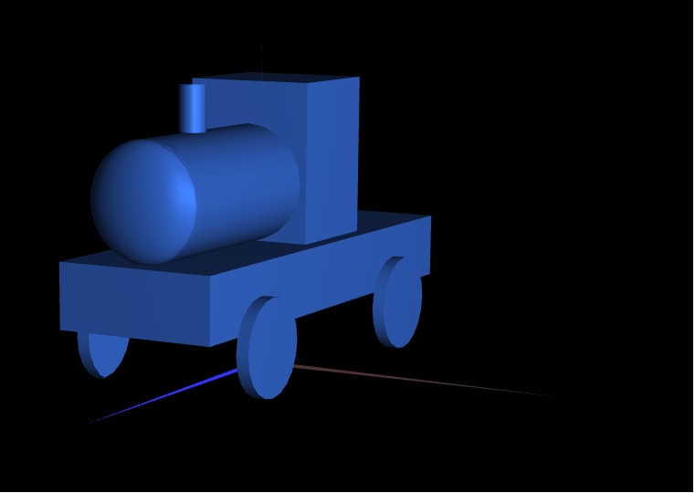
- In Point 6 we created the cube and applied the textures given by the teacher;
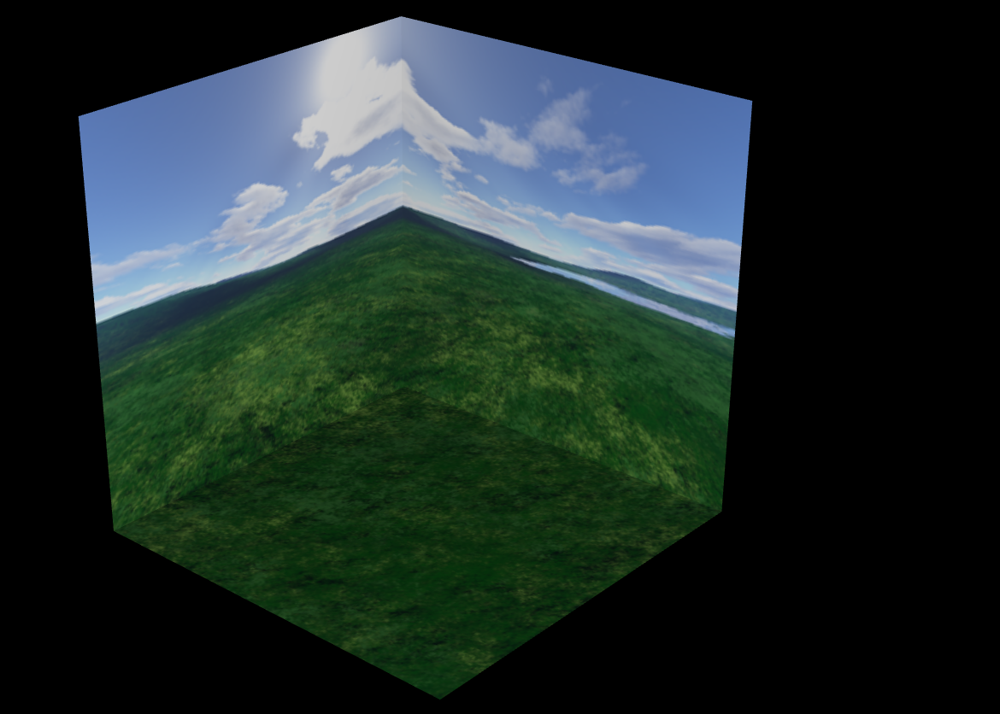
- In Point 7 we created the crane and we made it possible to grab the wood object;
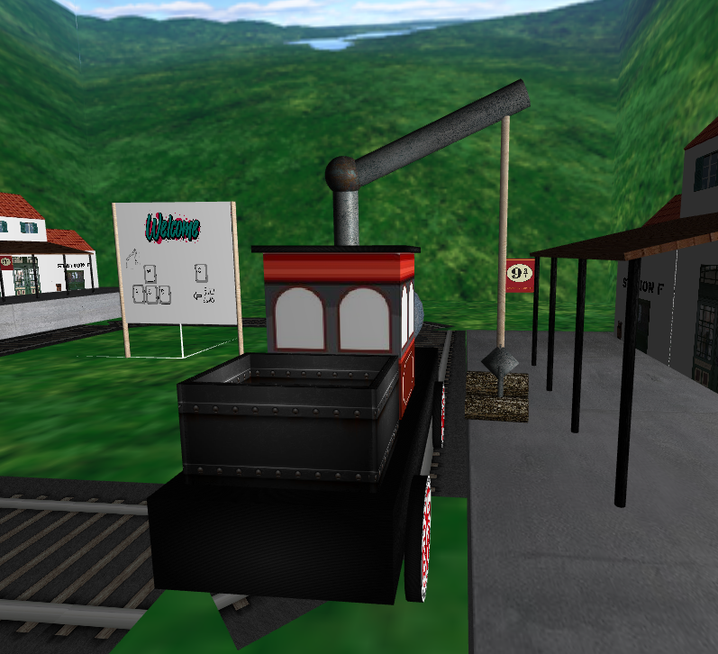
- In Point 8 we were able to place the wood on the back of the train;
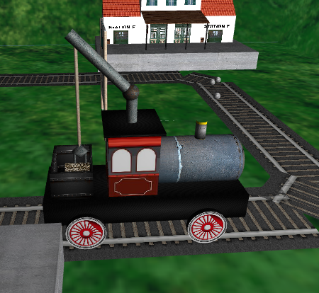
- In Point 9 we applied textures to the train to look more realistic;
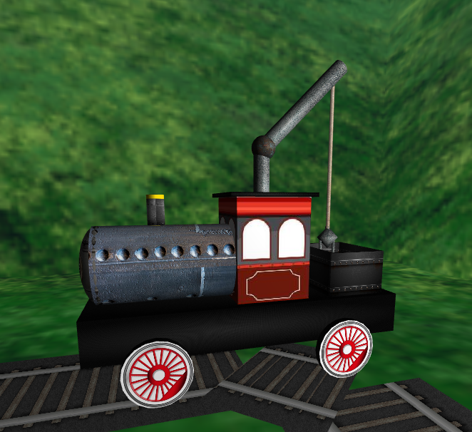
- In Point 10 we created the station and applied textures as asked;
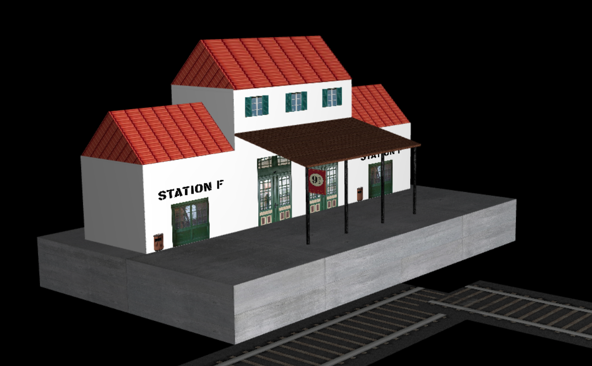
- In Point 11 we added more light to the scene;
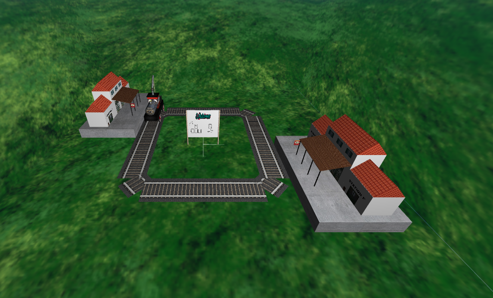 
- In Point 12 we added animation to the wheels of the train;
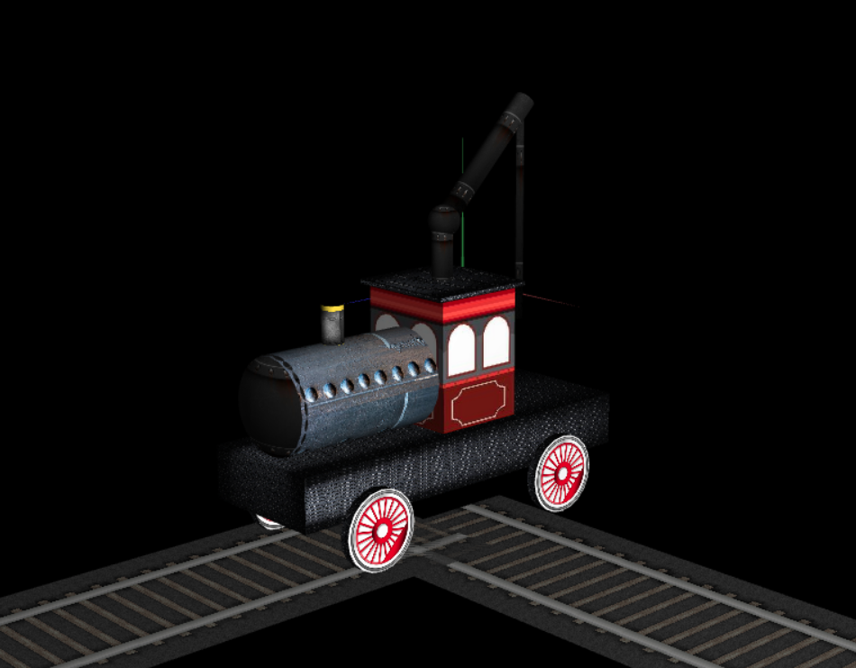
- In Point 13 we added smoke to the train which comes out from the chimney;
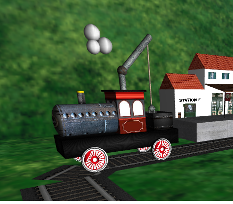
- In Point 14 we corrected the tracks to not overlap each other and create a flickering effect.
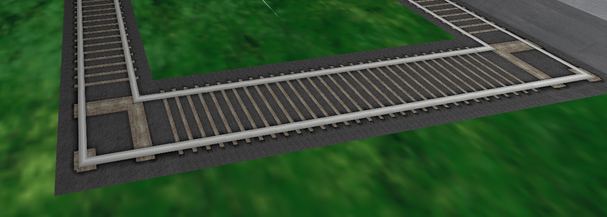
- In Point 15 we added rotation to the train when getting closer to changing segments of the track;
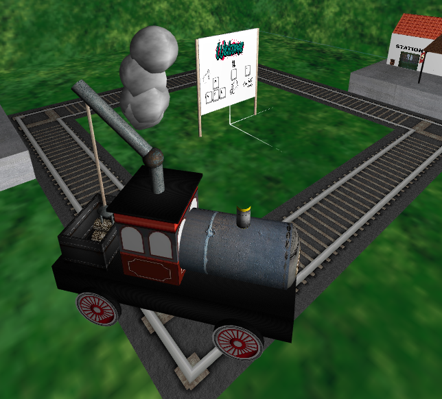

- Foram efetuadas todas as funcionalidades pedidas, incluindo as valorizações.

