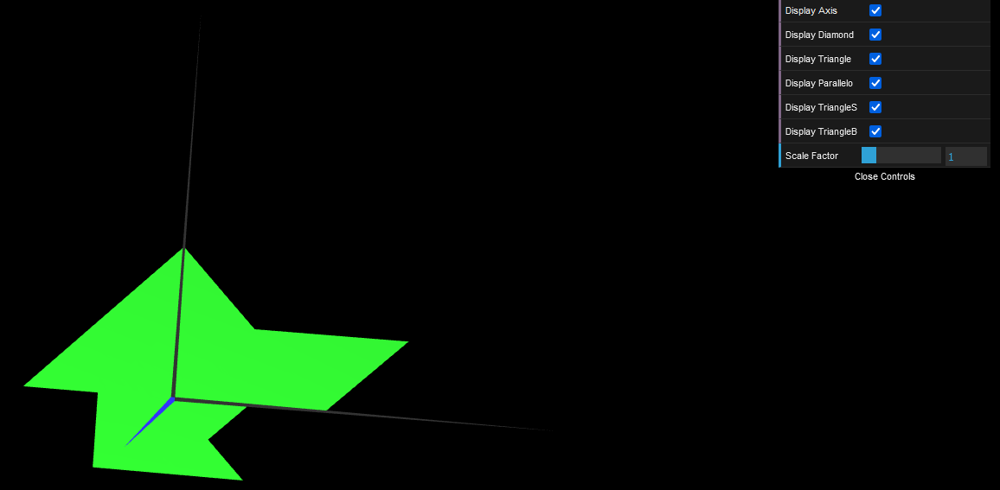

# CGRA 2021/2022

## Group T07G04

## TP 1 Notes

- In exercise 1 we created 2 more figures, a triangle and a parallelogram.
- In exercise 2 we created two more triangles, one being small and another being big.

