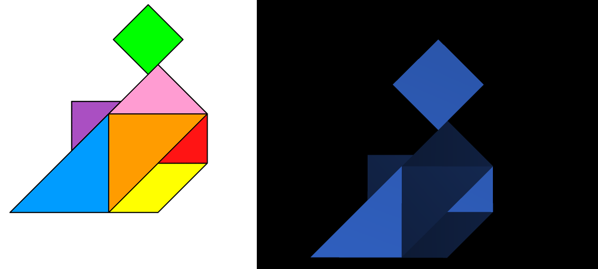
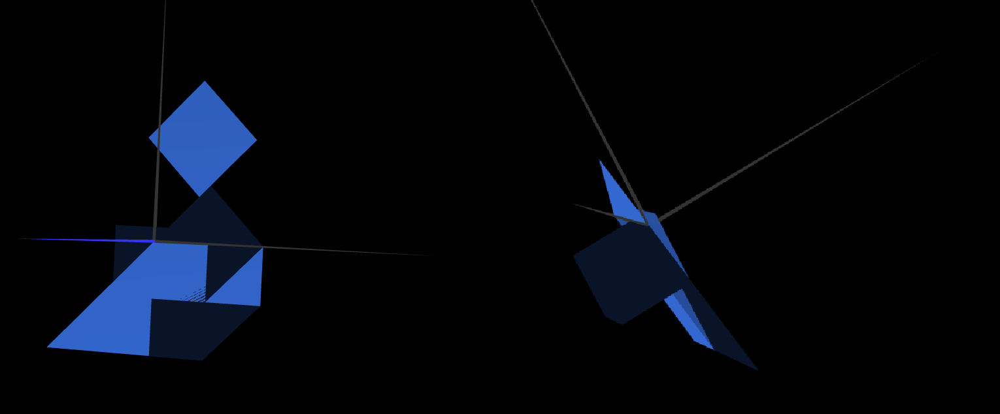
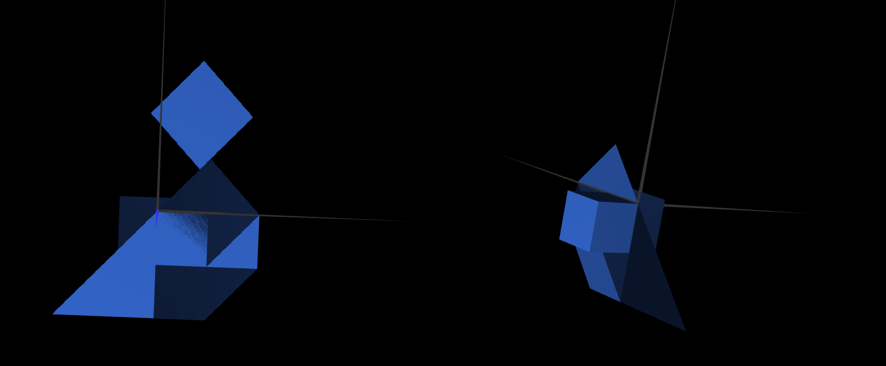

# CGRA 2021/2022

## Group T07G04

## TP 2 Notes

- In exercise 2 we replicated the tangram picture that was given to our group by using various methods of geometric transformations to our previous classes(Triangle, Diamond and Parallelogram);

- In exercise 3 we learn how to create a cube by also manipulating the Z coordinate;

- In exercise 4 we learn how to create a cube using squares and positioning them in order to make a cube;
