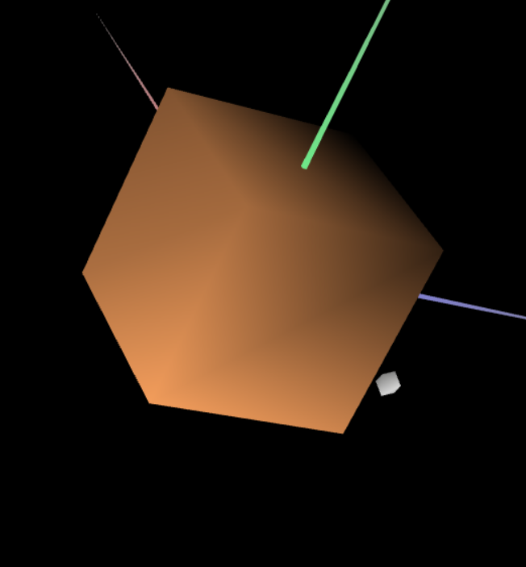
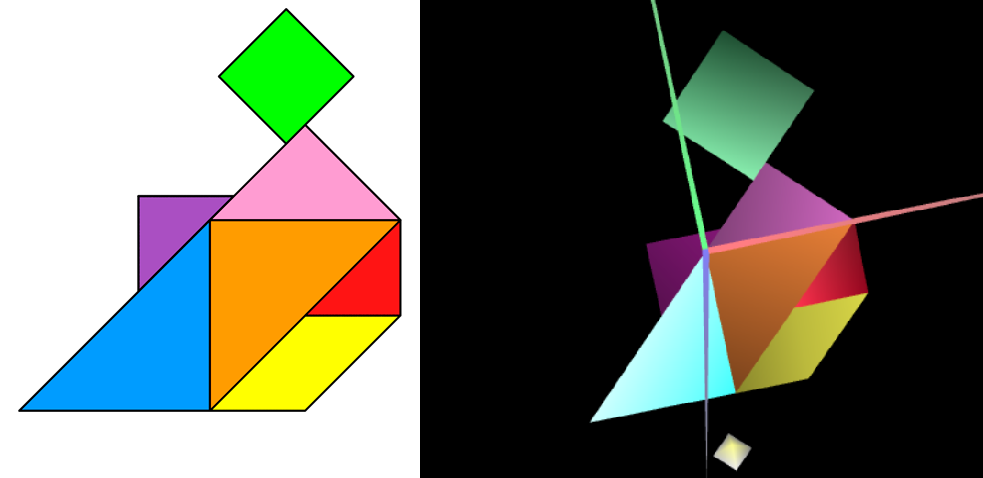

# CGRA 2021/2022

## Group T07G04

## TP 3 Notes

- With exercise 3 we learn to put texture and colors in the shapes we did on last tp (tangram, cube);

- We put the wood texture on the cube, it was the closest we could get

- Then we colored the shapes, as you can see in the attached screenshot.

