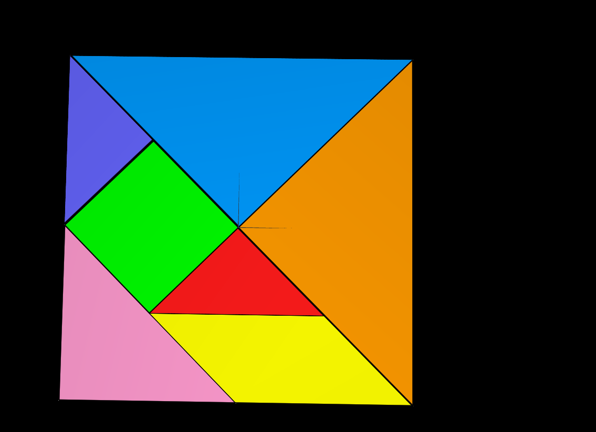
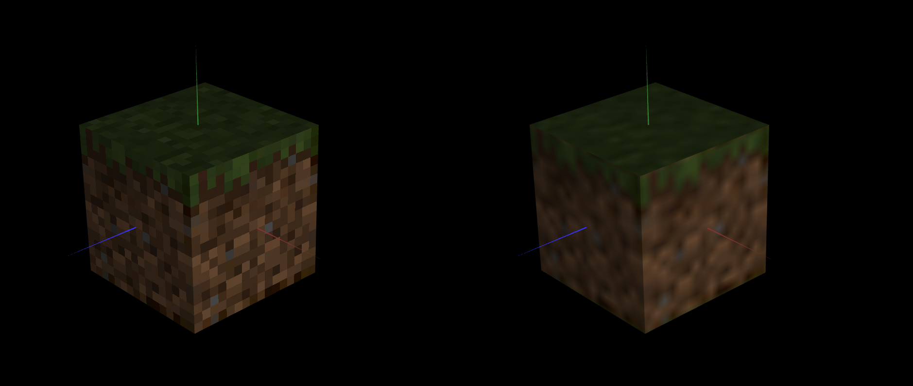

# CGRA 2020/2021

## Group T07G04

## TP 4 Notes

- In exercise 1 we learned how to apply textures to objects; 
- 
- In exercise 2 we learned how to apply textures to a 3 dimensional cube and linear interpolation .
- 